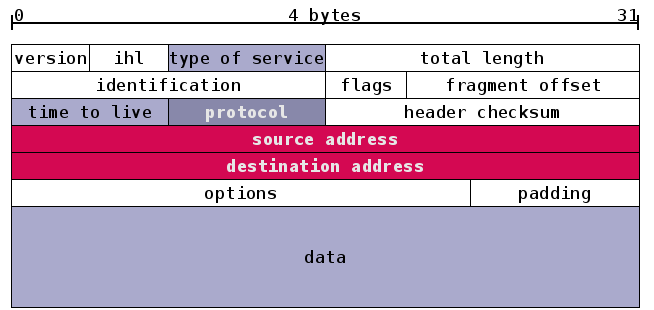

## 协议森林

参考[http://www.cnblogs.com/vamei](https://www.cnblogs.com/vamei/archive/2012/12/05/2802811.html)

### 物理层（physical layer）

所谓的物理层，是指光纤、电缆或者电磁波等真实存在的物理媒介。这些媒介可以传送物理信号，比如亮度、电压或者振幅。对于数字应用来说，我们只需要两种物理信号来分别表示0和1，比如用高电压表示1，低电压表示0，就构成了简单的物理层协议。针对某种媒介，电脑可以有相应的接口，用来接收物理信号，并解读成为0/1序列。

### 连接层（link layer）

用以判断将信送往哪个邮局。

- 传输单位：数据帧（frame）：信封

| Preamble | SFD  | DST  | SRC  | Type | Payload(Data) | Pad  | FCS  | Extension |
| -------- | ---- | ---- | ---- | ---- | ------------- | ---- | ---- | --------- |
|          |      |      |      |      |               |      |      |           |

- 主要协议：以太网（Ethernet）、WiFi、ARP

- 主要设备：交换器（switch）、集线器（hub）

- 涉及方法：

    - 时钟复原(recover the clock)：

        帧以序言开始，是为了让接收设备调整接收频率，以便与发送设备的频率一致，这个过程就叫做时钟复原。

    - 校验序列(FCS, Frame     Check Sequence)：

        FCS采用了CRC(Cyclic Redundancy Check)算法来校验数据。

### 网络层（network layer）

- 传输单位：IP 数据包（datagram）

    IPv4数据包：

    

- 主要协议：IPv4、IPv6

- 主要设备：网卡(NIC, Network Interface Card)、路由器（router）：邮局

- 涉及方法：

    - IP包接力（routing）：

        路由器根据路由表（routing table）将IP包一级级传给下一个路由器的过程。

    - ARP协议：

      用以规定IP地址跟 MAC 地址的对应关系。

    - Routing table 的生成：
      - RIP(Routing      Information Protocol)：

          根据距离 （途经路由器个数）来生成合理的路由表。（路由器个数上线为15，这个互联的部分称为“自治系统“）

      - BGP(Border Gateway     Protocol)：

          用以生成各个自治系统之间的路由表。

    - 地址耗尽危机：

        由于IPv4地址为32位，目前已耗尽，因此需要向IPv6迁移，IPv6为128位。

    - 碎片化问题：

        - 由于不同的局域网所支持的最大传输单元(MTU, Maximum Transportation Unit)不同，当MTU较大局域网的数据传输给MTU较小局域网时，就需要将数据碎片化传输。
        - IPv6在设计上避免碎片化。每一个IPv6局域网的MTU都必须大于等于1280      bytes。IPv6的默认发送IP包大小为1280 bytes。

    - Best effort：

        IP传输效率优先，不管质量及顺序问题。

    - ICMP(Internet     Control Message Protocol)：

        它是介于网络层和传输层的协议。它的主要功能是传输网络诊断信息。

        ICMP协议是实现ping命令和traceroute命令的基础。这两个工具常用于网络排错。

### 传输层（transport layer）

- 传输单位：UDP包、TCP片段（segment）

- 主要协议：TCP、UDP

- 涉及方法：

  - 端口（port）和socket：
    - 端口是伴随着传输层诞生的概念。它可以将网络层的IP通信分送到各个通信通道。
    - 我们也可以调用操作系统中的API，来构建socket。Socket是操作系统提供的一个编程接口，它用来代表某个网络通信。应用程序通过socket来调用系统内核中处理网络协议的模块，而这些内核模块会负责具体的网络协议的实施。这样，我们只需要提供相关信息(比如IP地址，比如端口号，比如所要传输的信息)，操作系统内核就会在传输之前根据我们提供的相关信息构成一个合格的UDP包(以及下层的包和帧)。

    - 简而言之：socket用以提供一种功能，来帮助我们在给出需要信息后，生成一个合格的UDP或TCP包。

- UDP(User Datagram     Protocol)：

    Best effort工作模式。UDP协议实现了端口，从而让数据包可以在送到IP地址的基础上，进一步可以送到某个端口。

- TCP(Transportation     Control Protocol)：

  - 以文本流（byte stream）的形式传输，是有序的，可靠的。TCP片段头部存有序号来实现有序，使用重复发送来实现可靠，采用滑窗（sliding window）来提高效率。
  - TCP连接是双向的（duplex）。连接的开始需要3次握手，结束需要4次握手。

- TCP流量控制(flow     control)：

    接收方将advertised window的大小通知给发送方，从而指导发送方修改offered window的大小。发送方在收到window size的通知时，会调整自己滑窗的大小，让offered window和advertised window相符。这样，发送窗口变小，文本流发送速率降低，从而减少了接收方的负担。

- TCP堵塞控制(congestion     control)：

  - TCP协议根据网络堵塞情况维护一个congestion window      size，真实滑窗大小取congestion window size和advertised window size 中的小者。
  - Congestion control设置初始速率为1，然后速率成倍增长，直到片段丢失，重置速率为1。

- TCP白痴窗口综合症 (Silly     Window Syndrome)：

  - 当接收方接收数据拥堵时，为了实现流量控制，会发送小的窗口给发送方，如果发送方接收数据也出现拥堵，就会发送一个小窗口给接收方，导致恶性循环。

  - 为了解决这个问题，需要从两方面入手。TCP中有相关的规定，要求：

    1. 接收方宣告的窗口必须达到一定的尺寸，否则等待。

    2. 除了一些特殊情况，发送方发送的片段必须达到一定的尺寸，否则等待。特殊情况主要是指需要最小化延迟的TCP应用(比如命令行互动)。

- TCP重新发送：

  - 超时重新发送：发送方发送完数据后开始计时，计时结束时判断为数据丢失，重复发送数据。
  - 快速重新发送：当发送方收到3次某个空洞数据（后面数据已收到，但是缺失该数据）ack时，启动快速重新发送，即，不再计时而是直接发送该数据。

### 应用层（application layer）

- 主要协议：DNS、HTTP、DHCP、SSL、TLS

- 涉及方法：

  - DNS（domain name system）:
    - 规定IP与域名的对应关系。

  - HTTP（HyperText Transfer Protocol）：

    - HTTP协议的通信是一次request-responce交流。客户端(guest)向服务器发出请求(request)，服务器(server)回复(response)客户端。
    - HTTP通信是无状态(stateless)的。服务器认为每次请求都是一个全新的请求，无论该请求是否来自同一地址。

  - DHCP（Dynamic Host Configuration Protocol）：

    - 在设备连接到网络时，DHCP服务器将给电脑提供合理的网络配置，并把设置信息传回本机。如动态分配IP地址。

  - SSL（Secure Sockets Layer）与TLS（Transport Layer Security Protocol）：

    - SSL/TLS协议利用加密的方式，在开放的互联网环境中实现了加密通信，让通信的双方可以安心的说悄悄话。这两个协议的工作方式类似，但TLS协议针对SSL协议进行了一些改善。

## TCP编程

Socket是网络编程的一个抽象概念。通常我们用一个Socket表示“打开了一个网络链接”，而打开一个Socket需要知道目标计算机的IP地址和端口号，再指定协议类型即可。

大多数连接都是可靠的TCP连接。创建TCP连接时，主动发起连接的叫客户端，被动响应连接的叫服务器。

### 客户端（client）

```python
import socket

# 创建一个socket
s = socket.socket(socket.AF_INET, socket.SOCK_STREAM)
s.connect(('127.0.0.1', 9999))

# 接收欢迎信息，并打印
print(s.recv(1024).decode('utf-8'))

for data in [b'Michael', b'Tracy', b'Sarah']:
    # 发送数据
    s.send(data)
    # 接收数据，并打印
    print(s.recv(1024).decode('utf-8'))
s.send(b'exit')

# 关闭连接
s.close()
```

创建`Socket`时，`AF_INET`指定使用IPv4协议，如果要用更先进的IPv6，就指定为`AF_INET6`。`SOCK_STREAM`指定使用面向流的TCP协议。

客户端要主动发起TCP连接，必须知道服务器的IP地址和端口号。`127.0.0.1`是一个特殊的IP地址，表示本机地址。端口号小于1024的是Internet标准服务的端口（如，Web服务：80，SMTP服务：25，FTP服务：21等，），端口号大于1024的，可以任意使用。

### 服务器端（server）

服务器进程首先要绑定一个端口并监听来自其他客户端的连接。如果某个客户端连接过来了，服务器就与该客户端建立Socket连接，随后的通信就靠这个Socket连接了。

所以，服务器会打开固定端口（比如80）监听，每来一个客户端连接，就创建该Socket连接。由于服务器会有大量来自客户端的连接，所以，服务器要能够区分一个Socket连接是和哪个客户端绑定的。一个Socket依赖4项：服务器地址、服务器端口、客户端地址、客户端端口来唯一确定一个Socket。

但是服务器还需要同时响应多个客户端的请求，所以，每个连接都需要一个新的进程或者新的线程来处理，否则，服务器一次就只能服务一个客户端了。

```python
import socket
import threading
import time

def tcplink(sock, addr):
    print('Accept new connection from %s:%s...' % addr)
    sock.send(b'Welcome!')
    while True:
        data = sock.recv(1024)
        time.sleep(1)
        if not data or data.decode('utf-8') == 'exit':
            break
        sock.send(('Hello, %s!' % data.decode('utf-8')).encode('utf-8'))
    sock.close()
    print('Connection from %s:%s closed.' % addr)

# 创建socket
s = socket.socket(socket.AF_INET, socket.SOCK_STREAM)

# 监听端口:
s.bind(('127.0.0.1', 9999))
s.listen(5)
print('Waiting for connection...')

while True:
    # 接受一个新连接:
    sock, addr = s.accept()
    # 创建新线程来处理TCP连接:
    t = threading.Thread(target=tcplink, args=(sock, addr))
    t.start()
```


## UDP编程

TCP是建立可靠连接，并且通信双方都可以以流的形式发送数据。相对TCP，UDP则是面向无连接的协议。

使用UDP协议时，不需要建立连接，只需要知道对方的IP地址和端口号，就可以直接发数据包。但是，能不能到达就不知道了。

虽然用UDP传输数据不可靠，但它的优点是和TCP比，速度快，对于不要求可靠到达的数据，就可以使用UDP协议。

### 客户端（client）

```python
import socket

# 创建一个socket
s = socket.socket(socket.AF_INET, socket.SOCK_DGRAM)

for data in [b'Michael', b'Tracy', b'Sarah']:
    # 发送数据
    s.sendto(data, ('127.0.0.1', 9999))
    # 接收数据，并打印
    print(s.recv(1024).decode('utf-8'))
# 关闭连接
s.close()
```

`SOCK_DGRAM`指定了这个Socket的类型是UDP。

### 服务器端（server）

```python
import socket

# 创建socket
s = socket.socket(socket.AF_INET, socket.SOCK_DGRAM)

# 绑定端口:
s.bind(('127.0.0.1', 9999))
print('Bind UDP on 9999...')

while True:
    # 接受数据:
    data, addr = s.recvfrom(1024)
    print('Received from %s:%s.' % addr)
    if not data or data.decode('utf-8') == 'exit':
        break
    s.sendto(b'Hello, %s!' % data, addr)
```

`recvfrom()`方法返回数据和客户端的地址与端口，这样，服务器收到数据后，直接调用`sendto()`就可以把数据用UDP发给客户端。

